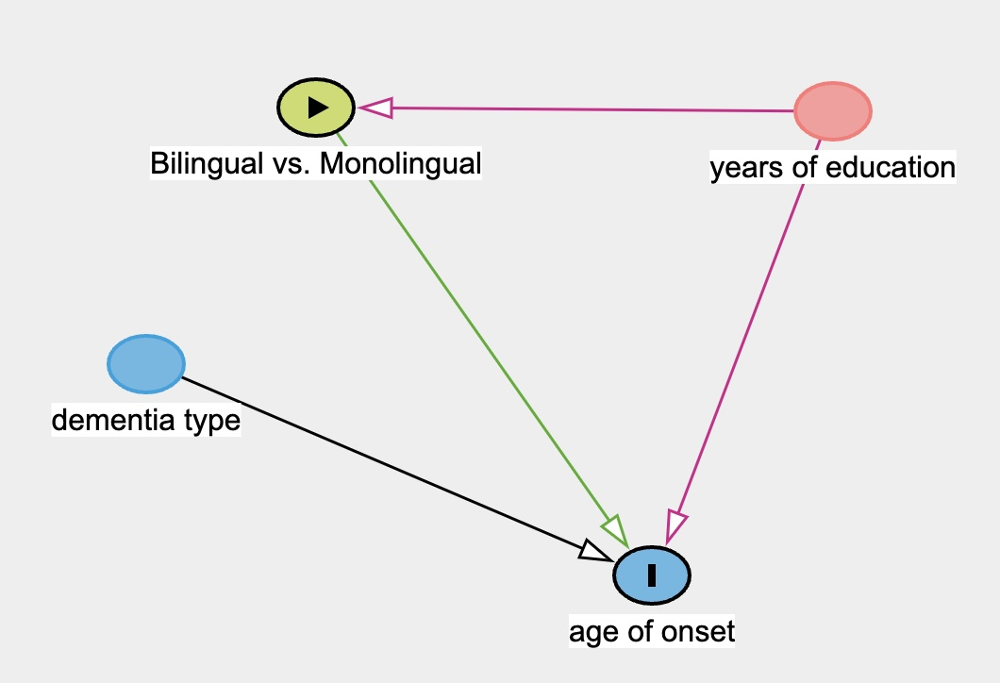
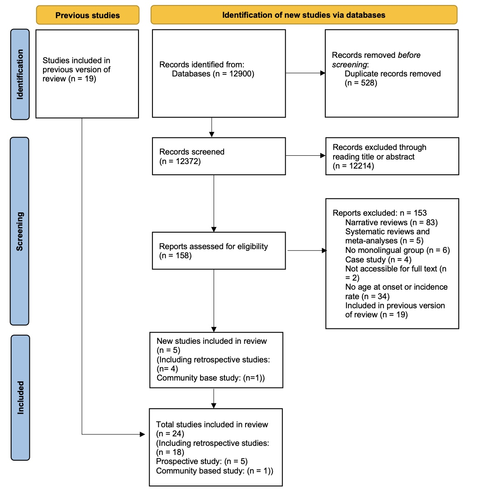
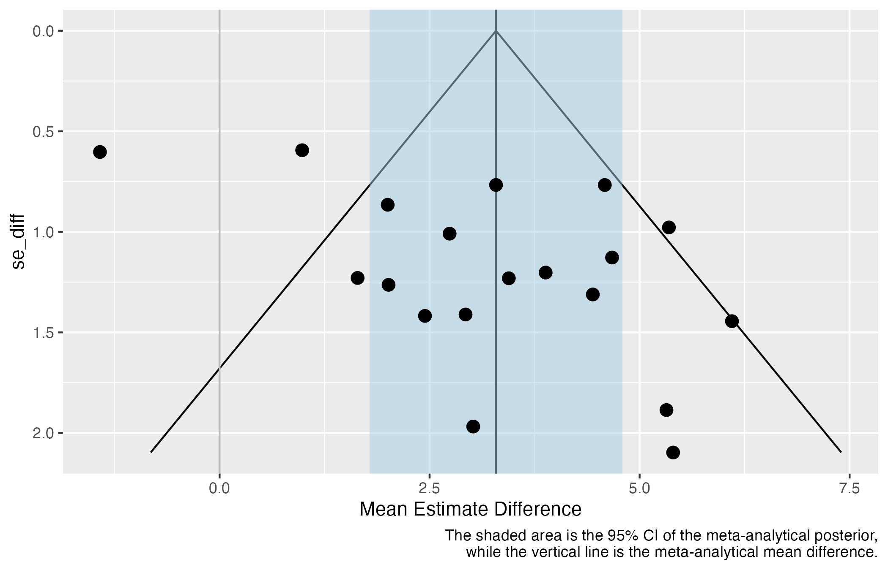

```{r setup, include=FALSE}
library(tidyverse)
library(brms)
library(broom.mixed)
library(posterior)
library(knitr)
library(ggplot2)
library(tidybayes)
library(stats)
library(lmtest)
library(ggdist)
library(bayesmeta)
library(bayesplot)
library(metafor)
library(marginaleffects)
library(dplyr)
library(forcats)
library(stringr)
library(purrr)
library(glue)
library(here)
library(magick)

seed <- 999
```

# Introduction

The aging adults may face an increasing risk of dementia, a syndrome resulting from a range of neurodegenerative diseases, as a result of deterioration of brain tissue [@de2018] and a loss of functional connectivity between regions [@brier2012]. Such diseases affect language skills, memory and in later stages, bodily functions [@homer1994; @berkes2022]. With the aging population and increased longevity of life, the prevalence of dementia also increases [@anderson2020; @berkes2022]. According to the @who2020, the total number of patients with dementia may rise to 82 million in 2030 and more than 150 million in 2050, which will bring enormous physical and psychological stress on both individual and societal levels. Unfortunately, it is still unclear how to prevent the pathology in aging adults [@kepp2016]. [While recent pharmacological advances, particularly anti-amyloid monoclonal antibody therapies, have shown significant results in double-blind, placebo-controlled phase III clinical trials]{.red} [@budd2022; @sims2023; @van2023], [the clinical meaningfulness, the long-term impact of these treatments and the actual therapeutic efficacy and accessibility for the real-world population are still under debate]{.red} [@angioni2024]. [Consequently, exploring non-pharmacological contributors to cognitive resilience remains a crucial avenue of research]{.red}. Several socio-behavioural factors may contribute to cognitive reserve, which helps individuals use compensatory mechanisms or functional processes to cope with neurodegeneration and pathology [@bialystok2007]. These factors include education [@stern1999], complex social networking [@bennett2006], challenging occupational tasks [@stern2020], increasing physical activity [@sofi2011], and bilingualism [@bak2016; @jafari2021].

Recently, numerous studies have focused on the potential bilingualism effect on cognitive enhancements, including improved attentional control, working memory, metalinguistic and metacognitive awareness. Moreover, these enhancements resulting from bilingualism across the lifespan may contribute to cognitive reserve, which delays the onset of dementia for 4 to 5 years according to some retrospective studies [e.g., @bialystok2007; @craik2010]. Yet, prospective studies revealed inconclusive results on bilingualism’s effect on reducing the risks of dementia [see @lawton2015 for null results; @zahodne2014 for positive results] while other retrospective studies showed a shorter delay of onset of dementia [e.g., 1.5 years: @berkes2020; 0.9 years: @chertkow2010]. Previous meta-analyses also revealed inconsistent results. The meta-analysis by @mukadam2017 only included four prospective studies and found no evidence for the protective effects of bilingualism on dementia while @anderson2020 meta-analysis that included 15 age-of-onset studies and 6 incidence studies found moderate evidence for bilingualism’s delaying of symptoms (Cohen’s d = 0.32) and weak evidence for bilingualism’s reducing the incidence of having the AD (d = 0.10). Despite such inconsistency, one potential modulating variable, dementia types, has been neglected by previous meta-analyses. @lee2022 pointed out that different subtypes of dementia seem to be deferred by different lengths of time in bilinguals compared with monolinguals. For instance, in @alladi2013, bilingualism’s delayed length of onset was 3.2 years, 6.0 years, 3.7 years, and 2.3 years for Alzheimer’s dementia (AD), frontotemporal dementia (FTD), vascular dementia (VaD) and dementia with Lewy bodies (DLB). Therefore, it would be necessary to conduct a new meta-analysis to include more recent research and examine the effect of dementia types to better address the bilingualism-dementia link.

# Mechanisms behind Bilingualism’s Effect on Dementia

## Introducing Cognitive Reserve

Reserve in a broader sense refers to the individual variations in cognitive ability, clinical condition, and functional capacity in aging and brain disease, which indicates that specific conditions of brain health can lead to different cognitive or functional outcomes in different individuals [@berkes2022]. @stern2020 stated that there are different types of reserve, namely brain reserve and cognitive reserve. The former refers to the neurobiological quality, such as cortical thickness, quantity of neurons, and total brain volume at a given point in time [@stern2020]. Individuals with high brain reserve are supposed to better withstand aging and neurological decline since they have more tissue to lose. Such a passive model of reserve is impacted by genetic and lifestyle factors, and it does not invoke active cognitive adaptation [@stern2020]. In contrast, cognitive reserve is thought of as an active reserve form which depends on individuals’ adaptability to cognitive processes [@berkes2022]. As mentioned before, Individuals can adopt remedial mechanisms to better cope with aging and brain loss [@berkes2022]. In this sense, there should be several outcomes when comparing high-cognitive reserve and low-cognitive reserve aging adults. At similar levels of neuropathology, high cognitive reserve individuals should show better cognitive performance than their low cognitive reserve peers. For individuals with similar cognitive performance, high-cognitive reserve individuals are expected to have more neuropathology than low-cognitive reserve individuals. Moreover, high-cognitive reserve individuals are expected to show delayed symptom onset compared with matched low-cognitive reserve individuals.

There are many factors that may contribute to cognitive reserve, which are limited by two prerequisites [@berkes2022]. The first one is that these factors should be sufficiently challenging and continuous [@scarmeas2003]. The second one is that individuals with higher levels of these factors or richer experience of the potential activities should show better cognitive condition. Thus, these factors should include both activities from early life, such as higher education and ongoing activities, such as challenging physical and mental activities [@stern2002; @stern2012].

## Bilingualism as a Contributor of Cognitive Reserve

The use of multiple languages is considered a challenging activity since bilinguals have to constantly deal with the joint activation of both languages [@bialystok2012]. Evidence for such joint activation is found by psycholinguists from cross-language priming, which is the facilitative effect of a word in one language on the retrieval of a semantically related word in another language [e.g., @thierry2007]. This means that bilinguals have to select the appropriate language while inhibiting the others for effective language production, which allows bilinguals to possess better inhibitory control than monolinguals. Yet, @bialystok2022 argue that inhibitory control is not enough to account for bilingualism’s enhanced cognitive function (EF) since dual language use involves not only inhibition but also facilitation of relevant processing, selection, and working memory. Despite different theories of explanation for the bilingualism effect, numerous empirical studies have shown that bilinguals outperform their monolingual peers on executive function tasks [e.g., @blom2014; @comishen2021]. The “advantage” is generally more obvious in older adults with null results mostly found in younger adults who may reach the ceiling effect.

From the perspective of neuroscience, one explanation for bilinguals' enhanced executive function may be that multiple language use reallocates the cognitive demand from anterior regions to posterior lobes and subcortical regions including the basal ganglia [@grundy2017]. The anterior lobes are typically believed to be involved in complex EF tasks, while posterior and subcortical regions are largely believed to be involved in automatic processing. Several neuroimaging studies have provided evidence for such a shift to improve neural efficiency in the bilingual brain. For instance, @abutalebi2015 used fMRI to record bilingual and monolingual brain signals when they performed flanker tasks. The results show that bilinguals showed better behavioural performance and that they recruited less anterior cingulate cortex (ACC) than monolinguals [@abutalebi2015]. In @waldie2009, the fMRI results showed that Macedonian-English bilinguals possessed more activation in the basal ganglia area compared with monolinguals when they performed a Stroop task. Since the basal ganglia is a subcortical area that functions as a gate for anterior cortical regions, @waldie2009 also provide evidence for bilinguals’ reallocation of cognitive resources.

As adults age, their decreased automatic processing ability requires them to occupy the anterior lobes that are originally responsible for complex EF with simple tasks [@grady1994; @davis2008]. This should at least partially account for older adults’ difficulty in performing complex tasks and declined cognitive function [@davis2008]. Thus, bilingualism contributes to cognitive reserve by reallocating the cognitive demand from anterior regions to posterior and subcortical regions and sustaining the automatic process, which leaves space for complex EF.

## The Limits of Bilingualism Effect on Dementia

Following the above argument, bilinguals who are high cognitive reserve individuals are supposed to better withstand neurodegeneration than monolinguals who are low cognitive reserve individuals. However, studies from different perspectives (prospective and retrospective) revealed different results, which indicates that there are limits [to what]{.red} bilingualism can do in terms of protection against dementia. The following part will briefly introduce previous studies and meta-analyses on the perspectives respectively.

As mentioned before, one important prediction from cognitive reserve is that individuals with high reserve will show a delayed onset of impairment [compared to]{.red} individuals with low reserve [@berkes2022]. Retrospective studies compared the age of onset or diagnosis of dementia for both bilinguals and monolinguals in clinical samples. @bialystok2007 were the first to examine such effects on clinical populations with dementia. By examining the records of 184 patients with equivalent progression of Mini-Mnetal State Examination [MMSE; @folstein1975] scores in Toronto Canada, they found that bilingual patients developed symptoms of dementia later than their monolingual peers for around 4 years (F (1, 178) = 9.16, p\<0.003). The results have been replicated in different populations in various countries such as China [@zheng2018], India [@alladi2013], and Belgium [@woumans2015]. Given the mostly positive results of previous retrospective studies and the moderate effect (Cohen’s d = 0.32) of previous meta-analysis [@anderson2020], it seems that bilingualism’s delaying effect is less inconclusive than incidence rate studies.

Compared to retrospective studies, most prospective studies have a different outcome variable, the dementia incidence rate in certain populations [@grundy2017]. These studies track groups of healthy individuals and collect the rates of dementia in the groups during the study period. Yet, these prospective studies tend to find non-significant results of bilingualism’s preventive effects. For instance, @zahodne2014 followed a sample of 1067 old Spanish-English bilinguals and Spanish monolinguals in New York while collecting their cognitive test scores and clinical diagnoses every 18 to 24 months for approximately 20 years. At the end of the study, 31% of monolinguals and 20% of bilinguals had been diagnosed [with]{.red} dementia [@zahodne2014]. The results showed that bilingualism was associated with a 0.291 lower log odds of incidence rates. After accounting for other predictors, bilingualism was not correlated with dementia risk despite attending higher education and being female being associated with lower dementia risk [@zahodne2014]. Similarly, @lawton2015 and @ljungberg2016 also found no single correlation between reduced dementia risk and bilingualism in the US (x2(1, n=81) = .13, p = .72) and Sweden (bilinguals: Hazard Ratio = 1.43, 95% CI = 0.73 − 2.85, p = .29) respectively. Moreover, @mukadam2017 conducted a meta-analysis using only four prospective studies and found that bilingualism was not related to the protective effect of cognitive decline or dementia (Odds Ratio of dementia rates in bilinguals compared with monolinguals: 0.96 with a 95% CI \[0.74 – 1.23\]). They further argued that public health policy should not recommend bilingualism as “a strategy to delay dementia” [@mukadam2017, p.53]. Yet the present study will argue that their argument is premature and that the difference [between]{.red} delaying effect and preventive effect should be drawn.

Since the publication of their meta-analysis [@mukadam2017], several scholars have criticised their conceptual and methodological approach [@woumans2017; @grundy2017]. For the conceptual issue, most prospective studies examined the dementia incidence rate, which is different from the age at onset of dementia, the outcome variable of retrospective studies. The interpretation of the null summary effect of the four prospective studies should not be conflated with bilingualism’s effect on the age of dementia onset. Thus, @mukadam2017 results can only partially show that there is no robust evidence that bilingualism can reduce the incidence rates of dementia. For the methodological issues, their meta-analysis neglected two additional studies that showed a bilingual advantage in their study. Additionally, one recent community study conducted by @venugopal2024 also found a bilingual effect on lower dementia risks among non-immigrant populations in India. Given these limitations of previous meta-analyses, the present meta-analysis will reexamine the bilingualism’s effect on age at onset of dementia and incidence rates, respectively.

Additionally, there may be some limits considering the effect of bilingualism on dementia. There is no reason to expect bilingualism as a factor of cognitive reserve to prevent dementia’s neuropathology since cognitive reserve helps the old to better withstand the impact of neuropathology, but not to avoid it from happening. If bilingualism indeed has a preventive effect against dementia, other mechanisms are supposed to be found to explain such an effect. Given these inadequacies of previous meta-analyses and the potential limits of the bilingualism effect, the present meta-analyses will reexamine the bilingualism’s effect on age at onset of dementia and incidence rates respectively.

## Research Questions

(1). Are there differences between the age at onset of dementia for bilinguals and monolinguals? If so, is the effect influenced greatly by bias? (2). Is there a [preventive effect of bilingualism]{.red} on dementia?{.red} (3). Are there other variables that influence the relation between bilingualism and age at onset of dementia?

To address the first research question, a Bayesian linear regression model will be fitted using the data from 18 retrospective studies to investigate the relation between bilingualism and age at dementia onset. The estimated difference in age at dementia onset between bilinguals and monolinguals will be calculated through the `avg_comparisons()` function [@arel2024]. The inspection for bias will be achieved through the funnel plot [@light1984]. For the second research question, another Bayesian linear regression model will be fitted using data from 6 incidence rate studies. For the last research question, this meta-analysis will first incorporate years of education as a confounding variable into the model. The results will indicate whether years of education strongly influence the effect of bilingualism on dementia. It will then run subgroup analyses to investigate whether bilingualism defers different types of dementia differently. This will be further explained in section 3.5.

# Methods

## Literature Searching

The datasets used in the present meta-analysis were PsycInfo, PubMed, and Google Scholar. A search of these databases and data extraction were conducted by Z.L. with the following keywords: ("bilingualism" OR "multilingualism") AND ("Alzheimer's disease" OR "dementia" OR "MCI").

## Inclusion and Exclusion Criteria

For a study to be included, it must meet the following criteria: (a). The study must include bilingual and monolingual samples. (b). The study should be about dementia or mild cognitive impairment (MCI). (c). The articles included need to provide necessary information for both bilingual and monolingual groups (i.e., for age at onset study: sample size, the mean age of onset and standard deviation of each group; for incidence rate study: sample size, the number of individuals who developed dementia during the study period). Additionally, they have to report the mean years of education and standard deviation for both bilingual and monolingual groups.

## Data Coding

After collecting the included studies, it is necessary to code the data for analysis. For the age at onset study, the column names in the data set include Study, mean, SD, N, dementia_type, and years_of_education. In detail, in the Study column, the last name of all the authors (if the number of authors is under three) or the last name of the first author (if the number of authors is above three) and [the]{.red} year of publication were extracted for each study. The mean and SD are the mean age at onset/diagnosis for dementia or MCI and its standard deviation. N is the number of participants in each group within each study. The monolingual and bilingual group is represented as monolingual and bilingual.

For incidence rate studies, the necessary columns in the data set are Study, Total, Dementia, and Group. Apart from the Study being the same coding approach, Total specifies the total number of participants in the prospective studies, while Dementia records the number of individuals who developed dementia during the study period. The monolingual and bilingual group is represented under the group column as monolingual and bilingual.

## Statistical Analysis

The present meta-analysis will employ the brm package in R [@burkner2021] to fit a meta-analytical model using a Bayesian linear regression with measurement error (se (Est.Error) in the model formula. In this sense, this meta-analysis is different from meta-analyses in the frequentist frameworks since it does not employ effect size and the summary effect (a point estimate) as the meta-analytic estimate [@schmid2020]. Instead, it produces a full posterior probability distribution of parameters, which reveals more uncertainty about the data. It is better for fields with limited data. The prior setting, forest plot and funnel plot drawing will be explained further in the results section.

## Confounding Variables and Modulating Factors

Apart from generating summary effects for included studies, it is necessary to check the effect of other confounding variables, especially when there is an inconsistent relation between an independent variable and an outcome across studies [@frazier2004]. The confounding variable is different from the modulating variable because their relations to the independent variable, outcome variable and the effect are different. A confounding variable has its influence on both the outcome (in this meta-analysis: age at onset or incidence rates) and the independent variable (bilingualism). A modulating factor influences or changes the interactions between variables. Following the previous meta-analysis [@anderson2020], the present study will also conduct an extra regression model to include the confounding variable years of education (YoE). Additionally, it will also conduct a subgroup analysis to compare the effect of types of dementia since the dementia type is a categorical variable that influences the potential bilingualism effect on delaying age at dementia onset. The following section will explain the reason to treat YoE as the confounding and the type of dementia as the modulating variable respectively.

### Education as a Confounding Variable

@bak2016 states that education and immigration status are two obvious confounding variables of bilingualism research. In a systematic review conducted by @sharp2011, 51 out of 88 studies that examined the relationship between dementia and education showed a significant effect. Their results show that lower education is related to increased risks of dementia, especially in developed countries [@sharp2011]. In some retrospective studies of bilingualism and dementia, the differences between the years of education of bilinguals and monolinguals were often noteworthy. For instance, the mean years of education for monolinguals and bilinguals were 6.9 and 13.9 respectively, in @alladi2017 and 4.92 and 10.97 in @zheng2018. Some studies argued that bilingualism was still a significant factor in delaying dementia onset after controlling for the covariates, including education [e.g., @alladi2013], yet the statistical power may be weak due to the small sample size @paap2019. Although the significant relationship between the risks of dementia and education was not always replicated @gatz2001, it is still necessary to examine its influence on the current result of the meta-analysis model. This is also because, in some areas, children have to attend education to be [bilingual]{.red}. For instance, in countries that consider English as a foreign language, such as China, students have to learn English at school to be Mandarin and English bilinguals. Therefore, the relation between education, bilingualism and dementia is shown in @fig-dag.

{#fig-dag fig-align="center"}

Additionally, immigration status has been argued to confound the bilingualism effect since healthier people are more likely to become immigrants, who are also bilingual [@fuller2014]. However, this meta-analysis will not further analyse the effect of immigration status because of the following reasons. Firstly, many studies demonstrating a bilingualism effect have shown that the influence of immigration status is limited since their participants were non-immigrants [e.g., @alladi2013; @zheng2018]. In other words, if the bilingualism’s protective effect on dementia is indeed due to the healthy immigrant effect, no bilingualism advantage is supposed to be found in these studies. Secondly, @brini2020 conducted subgroup analyses to compare the study that adjusted for immigration status to those that did not in their meta-analysis of bilingualism and age at onset of dementia. The results showed that the two subgroups were not significantly different concerning bilingualism’s delaying effect [@brini2020]. Thus, the present meta-analysis will not repeat the subgroup analysis of immigration status.

### Dementia Type as a Modulating Variable

As mentioned in the introduction, bilingualism’s effect may be different for different types of dementia [@alladi2013]. Even within the same sample, the difference in the delaying effect can be quite large [4 years for FTD dementia and 1.4 years for Mixed dementia in @alladi2013]. On the contrary, different types of dementia do not affect the bilingual status of individuals. Therefore, the types of dementia only modulate the strength of bilingualism effect on delaying the age at onset. Additionally, this meta-analysis also includes MCI studies, which are not traditionally dementia studies. It would be necessary to run subgroup analyses to better summarise its potential effect and to demonstrate whether the type of dementia is a source of inconclusive results. [The model for sub-group analysis is similar to the main Bayesian meta-analysis model, with the data restricted to the relevant sub-group.]{.red}

# Results

## Literature Searching

Shown in @fig-prisma, a total of 24 studies were included through searching the databases and checking the references of previous meta-analyses. Among the 24 studies, 18 studies’ primary outcome measures were age at onset/diagnosis of dementia or MCI (k = 18), and the rest of them were the risk of developing dementia (k = 6).

{#fig-prisma fig-align="center"}

To fit in the Bayesian meta-analysis model, we retrieved the summary data from each study, including the age at onset/diagnosis, standard deviation, number of individuals in bilingual and monolingual groups, years of education for each group, and dementia types in each study. One special case is that @zheng2018 included two monolingual groups: Mandarin and Cantonese. Different from previous meta-analyses [that]{.red} combine them into one monolingual group [@brini2020], the Bayesian linear model allows for two monolingual groups and one bilingual group. For the age at onset/diagnosis model, the final included sample was 23 pairs of participants (N = 3674, including 2023 monolinguals and 1641 bilinguals).

```{r read-data, echo=FALSE, include=FALSE}
retrospective_2 <- read_csv("data/retrospective.csv") %>% 
  mutate(
    SE = SD / sqrt(N),
    mobi = factor(group, levels = c("monolingual", "bilingual"))
  ) |> 
  select(-group)

```

## Prior Distribution Setting

For a specified Bayesian model, the posterior inference relies on both the likelihood and the prior [@schmid2020]. The present Bayesian random-effect model for age at onset studies specifies three priors. First, it specifies [an]{.red} LKJ (2) prior on the correlation matrix [@nicenboim2024]. The setting of its parameter 𝜂 = 2 would avoid favouring extreme correlations, which provides a relatively uninformative or weakly informative prior. Second, it specifies a Student-t distribution with 3 degrees of freedom, mean of 0 and scale of 9 since it is the brms default. This prior expects the standard deviations of the random effects to have large variability since different studies included in the meta-analysis may have large heterogeneity. Third, the prior for the main coefficients is a Gaussian distribution with mean = 65 and SD = 25. This indicates that values (in this case, age at onset of dementia) would fall within 95% CrI of (65 ± 2\*22.5) years. The reason for a prior belief of the mean age at onset to be centred around 65 is that most previous studies have dementia age at onsets around 58 and 76, which is important historical evidence [@turner2009]. Also, the 95 credible intervals of 20 and 110 provide enough variability for the age onset of adult neurodegenerative disease.

```{r echo=FALSE}
meta_analysismodel_1_priors <- c(
  prior(lkj(2), class = cor),
  prior(student_t(3, 0, 9), class = sd),
  prior(normal(65, 22.5), class = b)
)
```

## Results for Meta-analysis of Bilingualism and Age at Onset of Dementia

```{r echo=FALSE, include=FALSE}
meta_analysismodel_1 <- brm(
  mean | se(SE) ~ 0 + mobi + (0 + mobi | Study),
  data = retrospective_2,
  prior = meta_analysismodel_1_priors,
  cores = 4,
  file = "data/cache/meta_analysismodel_1",
  seed = seed
)
summary(meta_analysismodel_1)

```

```{r echo=FALSE, include=FALSE}
plot(meta_analysismodel_1, ask = FALSE)
```

```{r echo=FALSE, include=FALSE}
avg_comparisons(meta_analysismodel_1, variables = "mobi")
```

We fitted a Bayesian linear regression model with [language group (bilingual vs. monolingual)]{.red} as the predictor, mean (age at onset) as the outcome variable and measurement error (added with se (SE) at the left side of the model formula). [All models converged with acceptable R-hat and acceptable sample size values. The FTD subgroup model and MCI subgroup model finished with 40 and 16 divergent transitions respectively, which we did not deem problematic given the R-hat and effective sample size values.]{.red}

The results showed that at the population level, the estimated age at dementia onset for monolinguals was between 65.04 and 71.55 years at 95% CrI ($\beta$ = 68.39, Est.Error = 1.64). For bilinguals, the estimated age at dementia onset was between 68.82 and 74.61 years at 95% CrI ($\beta$ = 71.68, Est.Error = 1.49). [Comparing the posterior draws directly, the posterior probability that bilinguals had a later dementia onset than monolinguals was 1]{.red}. [We]{.red} further used the `avg_comparisons()` function to summarise the average marginal effects for bilinguals and monolinguals [@arel2024], which showed that the average marginal effect between the age at dementia onset for bilinguals and monolinguals was between 2.8 and 4.1 years at 95% CrI with an estimate of 3.45 years. This suggests that the bilingual population tends to have a later dementia symptom onset of around 3.45 years than monolinguals. A similar [trend]{.red} was also shown in the forest plot of the [study-specific]{.red} difference in effect for bilinguals and monolinguals, in which the majority of the studies have a positive value that favours bilingualism (see @fig-fig3). The majority of studies’ 95% credible interval was positive. Only one study [@duncan2018] resulted in a negative effect that monolinguals have a later dementia onset than bilinguals by around 1.42 years. [It is important to note that the credible interval of the predicted average estimate (from `avg\_comparisons()`) is narrower than those observed in the study-specific estimates in the forest plot. This is because the predicted estimate benefits from partial pooling across studies, which reduces uncertainty by borrowing strength from the entire dataset.]{.red}

Overall, [the meta-analytic effect showed a positive effect, indicating that bilingualism is associated with a delayed onset of dementia]{.red}. The following section explores the heterogeneity across the studies.

```{r echo=FALSE, include=FALSE}
# Check the variable names in the model draws
model_draws <- as_draws_df(meta_analysismodel_1)
names(model_draws)

```

```{r echo=FALSE, include=FALSE}
# Compute the difference between bilingual and monolingual
posterior_diff <- model_draws$b_mobibilingual - model_draws$b_mobimonolingual

# Summarize the posterior difference
mean_diff <- mean(posterior_diff)
ci_diff <- quantile(posterior_diff, probs = c(0.025, 0.975))
prob_bilingual_advantage <- mean(posterior_diff > 0)
prob_monolingual_advantage <- mean(posterior_diff < 0)

# Output the results
cat("Posterior difference (bilingual - monolingual):\n")
cat("Mean difference:", round(mean_diff, 2), "\n")
cat("95% Credible Interval:", round(ci_diff[1], 2), "to", round(ci_diff[2], 2), "\n")
cat("P(bilingual > monolingual):", round(prob_bilingual_advantage, 3), "\n")
cat("P(monolingual > bilingual):", round(prob_monolingual_advantage, 3), "\n")
```


```{r echo=FALSE, include=FALSE}
# Extract draws using the correct variable names
draws <- spread_draws(meta_analysismodel_1, 
                      b_mobimonolingual, 
                      b_mobibilingual, 
                      `r_Study[Alladi.et.al.2013,mobimonolingual]`, 
                      `r_Study[Alladi.et.al.2017,mobimonolingual]`,
                      `r_Study[Berkes.et.al.2020,mobimonolingual]`,
                      `r_Study[Bialystok.et.al.2007,mobimonolingual]`,
                      `r_Study[Bialystok.et.al.2014,mobimonolingual]`,
                      `r_Study[Chertkow.et.al.2010,mobimonolingual]`,
                      `r_Study[Clare.et.al.2016,mobimonolingual]`,
                      `r_Study[Craik.et.al.2010,mobimonolingual]`,
                      `r_Study[de.Leon.et.al.2020,mobimonolingual]`,
                      `r_Study[de.Leon.et.al.2024,mobimonolingual]`,
                      `r_Study[Duncan.et.al.2018,mobimonolingual]`,
                      `r_Study[Kowoll.et.al.2016,mobimonolingual]`,
                      `r_Study[Mendez..Chavez.&.Akhlaghipour.2020,mobimonolingual]`,
                      `r_Study[Ossher.et.al.2013,mobimonolingual]`,
                      `r_Study[Perani.et.al.2017,mobimonolingual]`,
                      `r_Study[Ramakrishnan.et.al.2017,mobimonolingual]`,
                      `r_Study[Woumans.et.al.2015,mobimonolingual]`,
                      `r_Study[Zheng.et.al.2018,mobimonolingual]`,
                      `r_Study[Alladi.et.al.2013,mobibilingual]`, 
                      `r_Study[Alladi.et.al.2017,mobibilingual]`,
                      `r_Study[Berkes.et.al.2020,mobibilingual]`,
                      `r_Study[Bialystok.et.al.2007,mobibilingual]`,
                      `r_Study[Bialystok.et.al.2014,mobibilingual]`,
                      `r_Study[Chertkow.et.al.2010,mobibilingual]`,
                      `r_Study[Clare.et.al.2016,mobibilingual]`,
                      `r_Study[Craik.et.al.2010,mobibilingual]`,
                      `r_Study[de.Leon.et.al.2020,mobibilingual]`,
                      `r_Study[de.Leon.et.al.2024,mobibilingual]`,
                      `r_Study[Duncan.et.al.2018,mobibilingual]`,
                      `r_Study[Kowoll.et.al.2016,mobibilingual]`,
                      `r_Study[Mendez..Chavez.&.Akhlaghipour.2020,mobibilingual]`,
                      `r_Study[Ossher.et.al.2013,mobibilingual]`,
                      `r_Study[Perani.et.al.2017,mobibilingual]`,
                      `r_Study[Ramakrishnan.et.al.2017,mobibilingual]`,
                      `r_Study[Woumans.et.al.2015,mobibilingual]`,
                      `r_Study[Zheng.et.al.2018,mobibilingual]`)
```

```{r fig-fig3, echo=FALSE, fig.cap="Forest plot of Bilingualism and Age at Onset of Dementia\n(Note: The estimates and 95% CrI are the differences between bilinguals and monolinguals, so a positive number indicates later onsets for bilinguals.)"}

draws_long <- draws %>%
  pivot_longer(
    cols = starts_with("r_Study"),
    names_to = c("Study", "Group"),
    names_pattern = "r_Study\\[(.*),(.*)\\]"
  )

# Calculate study-specific effects and differences
draws_diff <- draws_long %>%
  pivot_wider(names_from = Group, values_from = value) %>%
  mutate(
    study_effect_mono = mobimonolingual + b_mobimonolingual,
    study_effect_bi = mobibilingual + b_mobibilingual,
    difference = study_effect_bi - study_effect_mono
  ) %>%
  select(Study, .draw, difference)

# Summarize the differences for each study
draws_summary <- draws_diff %>%
  group_by(Study) %>%
  summarise(
    mean_diff = mean(difference),
    lower = quantile(difference, 0.025),
    upper = quantile(difference, 0.975)
  ) %>%
  ungroup()

# Add an summary effect row
overall_effect <- draws_diff %>%
  summarise(
    mean_diff = mean(difference),
    lower = quantile(difference, 0.025),
    upper = quantile(difference, 0.975)
  ) %>%
  mutate(Study = "Summary Effect")

draws_summary <- bind_rows(draws_summary, overall_effect)
# Ensure Study is character before factor level assignment
draws_summary <- draws_summary %>%
  mutate(Study = as.character(Study))

# Manually reorder studies by mean_diff, keeping Summary Effect at bottom
ordered_studies <- draws_summary %>%
  filter(Study != "Summary Effect") %>%
  arrange(mean_diff) %>%
  pull(Study)

draws_summary$Study <- factor(draws_summary$Study, levels = c("Summary Effect", ordered_studies))


# Generate the forest plot
ggplot(draws_summary, aes(x = mean_diff, y = Study)) +
  geom_vline(xintercept = 0, linewidth = .25, lty = 2) +  # Vertical line at zero
  geom_pointrange(aes(xmin = lower, xmax = upper), size = .5) +  # Plot credible intervals
  geom_point(size = 3, color = "dodgerblue") +  # Plot mean differences
  geom_point(data = subset(draws_summary, Study == "Summary Effect"),
             aes(x = mean_diff, y = Study),
             color = "firebrick", size = 5, shape = 18) +
  geom_text(
    aes(label = glue("{round(mean_diff, 2)} [{round(lower, 2)}, {round(upper, 2)}]"), x = max(upper) + 0.5), 
    hjust = 0, size = 2
  ) + 
  scale_y_discrete(limits = levels(draws_summary$Study)) +
  labs(
    title = "Forest Plot of Meta-analytic Effects",
    x = "Difference in Age at Onset",
    y = "Study",
  ) +
  theme_minimal() +
  theme(axis.text.y = element_text(size = 8)) + 
  coord_cartesian(clip = "off", xlim = c(-4, 16))
```

### Heterogeneity across Studies

In the present Bayesian meta-analysis model, heterogeneity was mainly expressed by the random effects at the group level, which was the difference in age at onset for [monolingual group and bilingual group]{.red} across different study levels. At the group level, the standard deviation for [monolingual group and bilingual group]{.red} was 7.13 with a 95% CrI \[5.24, 9.93\], and 6.54 with a 95% CrI \[4.79, 9.15\]. This relatively large standard deviation indicated that there was high heterogeneity across studies, although the summary meta-analytic effect was positive. This indicated that the summary effect may be influenced by the large heterogeneity and that it would be necessary to examine the source of such heterogeneity. Therefore, we used the spread_draws() function [@kay2023] to draw two new forest plots that show the difference between the population-level mean age at dementia onset and each study’s age at dementia onset for bilinguals and monolinguals, respectively (see @fig-fig4).

```{r}
#| label: fig-fig4
#| fig-cap: "Forest plot showing the estimated difference between each study’s estimate and population-level estimate grouped by bilingual and monolingual group (the dashed line marks the approximate boundaries between the three groups)."
#| fig-align: center

spread_draws(meta_analysismodel_1, r_Study[study,mobi]) %>% 
  mutate(mobi = str_remove(mobi, "mobi")) |> 
  ggplot(aes(r_Study, reorder(as.factor(study), r_Study, mean))) +
  geom_vline(xintercept = 0) +
  stat_halfeye() +
  geom_hline(yintercept = 6.5, linetype = "dashed") +
  geom_hline(yintercept = 10.5, linetype = "dashed") +
  facet_grid(~mobi) +
  labs(
  x = "Deviation from Population-Level Estimate",
  y = "Study")

```

As illustrated in @fig-fig4, the studies seemed to be divided into three groups for each of the two plots. The estimated mean age at onset for the first group of 8 studies was later than the population-level age at onset for around 3 to 8 years [@berkes2020; @bialystok2014; @chertkow2010; @clare2016; @craik2010; @ossher2013; @perani2017; @woumans2015]. For the second group of 6 studies, the mean age at onsets were earlier than the population-level age at onset for around 6 to 10 years (@alladi2013; @alladi2017; @de2020; @de2024; @ramakrishnan2017; @mendez2020). The third group of 4 studies (in the middle of the plot) were more complex, which clustered around the estimated population-level age at onset, yet with different patterns for bilinguals and monolinguals [@bialystok2007; @duncan2018; @kowoll2016; @zheng2018]. For instance, in @duncan2018, the estimated mean effect for the bilingual group was close to the population-level effect, but [the]{.red} monolinguals’ estimation was more than 5 years later than the population-level effect for monolinguals. Such a difference in monolingual and bilingual groups made @duncan2018 the only study that had a bilingual early mean dementia onset estimation, [as]{.red} shown in @fig-fig3.

A careful investigation into the contexts of each study provided some potential evidence for such heterogeneity. One prominent difference between the first and second groups of studies might be the type of dementia. Among the 6 studies in the second group, three of them involved the FTD variant of dementia, one of them involved MCI patients and the other two involved AD patients. In contrast, seven out of eight studies in the first group and all of the four studies in the third group involved AD patients despite one study having MCI patients. Such differences in the distribution of types of dementia among different groups of studies further called for subgroup analysis of different types of dementia and to investigate whether the type of dementia influences the differences in age at onset of dementia in bilinguals and monolinguals.

### The Role of Education is Uncertain

```{r echo=FALSE, include=FALSE}
meta_analysismodel_2 <- brm(
  mean | se(SE) ~ 0 + mobi + years_of_education + (0 + mobi | Study),
  data = retrospective_2,
  prior = meta_analysismodel_1_priors,
  cores = 4,
  file = "data/cache/meta_analysismodel_2",
  seed = seed
)
summary(meta_analysismodel_2)
```

```{r echo=FALSE, include=FALSE}
# Extract posterior draws from meta_analysismodel_2
model2_draws <- as_draws_df(meta_analysismodel_2)

# Compute the posterior difference: bilingual - monolingual
posterior_diff_model2 <- model2_draws$b_mobibilingual - model2_draws$b_mobimonolingual

# Summarize the posterior difference
mean_diff_model2 <- mean(posterior_diff_model2)
ci_diff_model2 <- quantile(posterior_diff_model2, probs = c(0.025, 0.975))
prob_bilingual_advantage_model2 <- mean(posterior_diff_model2 > 0)
prob_monolingual_advantage_model2 <- mean(posterior_diff_model2 < 0)

# Output the results clearly
cat("Posterior difference in Model 2 (bilingual - monolingual):\n")
cat("Mean difference:", round(mean_diff_model2, 2), "\n")
cat("95% Credible Interval:", round(ci_diff_model2[1], 2), "to", round(ci_diff_model2[2], 2), "\n")
cat("P(bilingual > monolingual):", round(prob_bilingual_advantage_model2, 3), "\n")
cat("P(monolingual > bilingual):", round(prob_monolingual_advantage_model2, 3), "\n")

```


```{r echo=FALSE, include=FALSE}
avg_comparisons(meta_analysismodel_2, variables = "mobi")
```

To examine whether years of education had an influence on the meta-analytic effect, [we]{.red} included years of education into the right side of the previous Bayesian linear model. The results showed that the population-level effect of "years of education" on the age at onset of dementia was between -0.63 and 0.36 at 95% CrI ($\beta$ = -0.11, Est.Error = 0.26). It was quite uncertain about the role of Education since the effect involves both negative and positive values. This indicates that we are still uncertain whether "years of education" has an effect on age at onset of dementia (either positive or negative) or not, based on the data in the meta-analysis.

Additionally, the estimated mean age at dementia onset for monolinguals and bilinguals was 69.62 years with a 95% CrI \[63.16, 77.00\] and 73.03 years with a 95% CrI \[66.05, 80.53\] after including years of education into the model. [The results from comparing posterior draws showed that the probability of bilinguals having delayed dementia onset was still 100\\%.]{.red} Using `avg_comparisons()` again, the mean average difference between the age at dementia onset for bilinguals and monolinguals was 3.65 years with a 95% CrI \[2.55, 4.91\]. The result was close to the previous model, where education was not included (3.45 years with a 95% CrI \[2.8, 4.1\]). Therefore, the results from Bayesian linear regression indicated that years of education did not have a strong effect on the effect of bilingualism on age at onset of dementia, although the role of education is uncertain.

### Subgroup Analysis of Dementia Type

| Study | Dementia Diagnosis | Type of Dementia or MCI | Mean Age of Diagnosis & Symptom Onset (SD) |
|-----------------|------------------|-----------------|--------------------|
| @alladi2013 | Cambridge Memory Clinic model | AD | ML: 65.4 (10.0); BL: 68.6 (9.6) |
| @bialystok2007 | NINCDS-ADRDA | AD | ML: 71.4 (9.6); BL: 75.5 (8.5) |
| @bialystok2014 | NA | AD | ML: 70.9 (11.0); BL: 78.2 (8.9) |
| @berkes2020 | MMSE, MoCA | AD | ML: 78.2 (7.7); BL: 79.8 (8.4) |
| @chertkow2010 | Patient & caregiver interviews | AD | ML: 76.7 (7.8); BL: 77.6 (7.2) |
| @clare2016 | LQ-SV | AD | ML: 76.2 (8.75); BL: 79.3 (6.78) |
| @craik2010 | NA | AD | ML: 72.6 (10); BL: 77.7 (7.9) |
| @de2020 | NA | AD | ML: 60.3 (9.8); BL: 61.9 (9.8) |
| @duncan2018 | NINCDS-ADRDA | AD | ML: 74.3 (1.5); BL: 72.6 (1.6) |
| @kowoll2016 | NINCDS-ADRDA | AD | ML: 71.6 (7.9); BL: 74.6 (6.8) |
| @perani2017 | NIA-AA | AD | ML: 71.4 (4.88); BL: 77.1 (4.52) |
| @mendez2020 | NIA-AA | AD | ML: 58 (10.7); BL: 62.4 (10.5) |
| @woumans2015 | Neurologist + Neuropsychologist | AD | ML: 73.8 (8.8); BL: 75.5 (8.2) |
| @zheng2018 | NINCDS-ADRDA | AD | ML: 63.9 (96.5), 63.4 (8.94); BL: 70.9 (9.37) |
| @alladi2013 | Cambridge Memory Clinic model | FTD | ML: 55.6 (10.5); BL: 61.6 (9) |
| @alladi2017 | MMSE, ACE-R, CDR, FrSBe | FTD | ML: 58.4 (9.3); BL: 61.7 (9.1) |
| @de2024 | NA | FTD | ML: 59 (9.2); BL: 61.4 (7.9) |
| @berkes2020 | MMSE, MoCA | MCI | ML: 75.5 (7.6); BL: 77.8 (8.2) |
| @ossher2013 | Neuropsychological interview | Single Domain aMCI | ML: 74.9 (49); BL: 79.4 (6.3) |
| @ossher2013 | Neuropsychological interview | Multiple Domain aMCI | ML: 75.2 (8.5); BL: 72.6 (7.2) |
| @ramakrishnan2017 | Petersen’s criteria | MCI | ML: 55.8 (12.2); BL: 63.2 (10.1) |

Table: Cross-sectional Studies of Three Dementia Subgroups

**Abbreviations**: ML = Monolinguals; BL = Bilinguals; AD = Alzheimer’s Disease, FTD = Frontotemporal Dementia, MCI = Mild Cognitive Impairment; aMCI = Amnestic Mild Cognitive Impairment\
ACE-R = Addenbrooke’s Cognitive Examination-revised; FrSBe = Frontal Systems Behaviour Scale;\
[LQ-SV = Language Questionnaire - Short Version]{.red};\
MMSE = Mini-Mental State Examination; MoCA = Montreal Cognitive Assessment;\
NINCDS-ADRDA = National Institute on Aging-Alzheimer’s Association consensus criteria

The subgroup analysis was used to compare whether the difference of the age at onset of dementia between bilinguals and monolinguals was different across different types of dementia. The studies were divided into three subgroups: AD dementia subgroup (including 14 studies), FTD dementia subgroup (including 3 studies), and MCI subgroup (including 3 studies), which are listed in the above table. The total number of studies was 20 because two studies [@alladi2013; @berkes2020] involved more than one type of dementia. For each subgroup, a Bayesian linear regression model which is similar to the main meta-analysis was employed with the same priors that had been set before.

```{r echo=FALSE, include=FALSE}
AD <- read.csv("data/AD.csv") %>% mutate(
    SE = SD / sqrt(N),
    mobi = factor(group, levels = c("monolingual", "bilingual"))
  ) |> 
  select(-group)

```

```{r echo=FALSE, include=FALSE}
meta_analysismodel_3 <- brm(
  mean | se(SE) ~ 0 + mobi + (0 + mobi | Study),
  data = AD,
  prior = meta_analysismodel_1_priors,
  cores = 4,
  file = "data/cache/meta_analysismodel_3",
  seed = seed
)
summary(meta_analysismodel_3)
```

```{r echo=FALSE, include=FALSE}
avg_comparisons(meta_analysismodel_3, variables = "mobi")
```

```{r echo=FALSE, include=FALSE}
model_draws <- as_draws_df(meta_analysismodel_3)
names(model_draws)
```

```{r echo=FALSE, include=FALSE}
# Compute the difference between bilingual and monolingual
posterior_diff3 <- model_draws$b_mobibilingual - model_draws$b_mobimonolingual

# Summarize the posterior difference
mean_diff <- mean(posterior_diff3)
ci_diff <- quantile(posterior_diff3, probs = c(0.025, 0.975))
prob_bilingual_advantage <- mean(posterior_diff3 > 0)
prob_monolingual_advantage <- mean(posterior_diff3 < 0)

# Output the results
cat("Posterior difference (bilingual - monolingual):\n")
cat("Mean difference:", round(mean_diff, 2), "\n")
cat("95% Credible Interval:", round(ci_diff[1], 2), "to", round(ci_diff[2], 2), "\n")
cat("P(bilingual > monolingual):", round(prob_bilingual_advantage, 3), "\n")
cat("P(monolingual > bilingual):", round(prob_monolingual_advantage, 3), "\n")
```


```{r echo=FALSE, include=FALSE}
# Extract draws using the correct variable names
draws <- spread_draws(meta_analysismodel_3, 
                      b_mobimonolingual, 
                      b_mobibilingual, 
                      `r_Study[Alladi.et.al.2013,mobimonolingual]`, 
                      `r_Study[Berkes.et.al.2020,mobimonolingual]`,
                      `r_Study[Bialystok.et.al.2007,mobimonolingual]`,
                      `r_Study[Bialystok.et.al.2014,mobimonolingual]`,
                      `r_Study[Chertkow.et.al.2010,mobimonolingual]`,
                      `r_Study[Clare.et.al.2016,mobimonolingual]`,
                      `r_Study[Craik.et.al.2010,mobimonolingual]`,
                      `r_Study[de.Leon.et.al.2020,mobimonolingual]`,
                      `r_Study[Duncan.et.al.2018,mobimonolingual]`,
                      `r_Study[Kowoll.et.al.2016,mobimonolingual]`,
                      `r_Study[Mendez..Chavez.&.Akhlaghipour.2020,mobimonolingual]`,
                      `r_Study[Woumans.et.al.2015,mobimonolingual]`,
                      `r_Study[Zheng.et.al.2018,mobimonolingual]`,
                      `r_Study[Alladi.et.al.2013,mobibilingual]`, 
                      `r_Study[Berkes.et.al.2020,mobibilingual]`,
                      `r_Study[Bialystok.et.al.2007,mobibilingual]`,
                      `r_Study[Bialystok.et.al.2014,mobibilingual]`,
                      `r_Study[Chertkow.et.al.2010,mobibilingual]`,
                      `r_Study[Clare.et.al.2016,mobibilingual]`,
                      `r_Study[Craik.et.al.2010,mobibilingual]`,
                      `r_Study[de.Leon.et.al.2020,mobibilingual]`,
                      `r_Study[Duncan.et.al.2018,mobibilingual]`,
                      `r_Study[Kowoll.et.al.2016,mobibilingual]`,
                      `r_Study[Mendez..Chavez.&.Akhlaghipour.2020,mobibilingual]`,
                      `r_Study[Woumans.et.al.2015,mobibilingual]`,
                      `r_Study[Zheng.et.al.2018,mobibilingual]`)
```

```{r fig-fig5, echo=FALSE, fig.cap="AD Subgroup: Forest plot of Bilingualism and Age at Onset of Dementia"}
# Reshape data to long format for easier handling
draws_long <- draws %>%
  pivot_longer(
    cols = starts_with("r_Study"),
    names_to = c("Study", "Group"),
    names_pattern = "r_Study\\[(.*),(.*)\\]"
  )

# Calculate study-specific effects and differences
draws_diff <- draws_long %>%
  pivot_wider(names_from = Group, values_from = value) %>%
  mutate(
    study_effect_mono = mobimonolingual + b_mobimonolingual,
    study_effect_bi = mobibilingual + b_mobibilingual,
    difference = study_effect_bi - study_effect_mono
  ) %>%
  select(Study, .draw, difference)

# Summarize the differences for each study
draws_summary <- draws_diff %>%
  group_by(Study) %>%
  summarise(
    mean_diff = mean(difference),
    lower = quantile(difference, 0.025),
    upper = quantile(difference, 0.975)
  ) %>%
  ungroup()

# Add an overall effect row
overall_effect <- draws_diff %>%
  summarise(
    mean_diff = mean(difference),
    lower = quantile(difference, 0.025),
    upper = quantile(difference, 0.975)
  ) %>%
  mutate(Study = "Summary Effect")
draws_summary <- bind_rows(draws_summary, overall_effect)


ordered_studies <- draws_summary %>%
  filter(Study != "Summary Effect") %>%
  arrange(mean_diff) %>%
  pull(Study)

draws_summary$Study <- factor(draws_summary$Study, levels = c("Summary Effect", ordered_studies))

# Optional: For annotation positioning
x_max <- max(draws_summary$upper) + 2

# Generate the forest plot
ggplot(draws_summary, aes(x = mean_diff, y = Study)) +
  geom_vline(xintercept = 0, linewidth = .25, lty = 2) +  # Vertical line at zero
  geom_pointrange(aes(xmin = lower, xmax = upper), size = .5) +  # Plot credible intervals
  geom_point(size = 3, color = "dodgerblue") +  # Plot mean differences
  geom_point(
    data = subset(draws_summary, Study == "Summary Effect"),
    aes(x = mean_diff, y = Study),
    color = "firebrick", size = 5, shape = 18  # Red diamond
  ) +
  geom_text(
    aes(label = glue("{round(mean_diff, 2)} [{round(lower, 2)}, {round(upper, 2)}]"), x = max(upper) + 0.5), 
    hjust = 0, size = 2
  ) +  # Add text labels for each study
  scale_y_discrete(limits = levels(draws_summary$Study)) +
  labs(
    title = "Meta-analytic Effect in AD Subgroup ",
    x = "Difference in Age at Onset",
    y = "Study",
  ) +
  theme_minimal() +
  theme(axis.text.y = element_text(size = 8)) + # Adjust text size if needed
  coord_cartesian(clip = "off", xlim = c(-4, 16))
```

For the AD dementia subgroup (see @fig-fig5 for the forest plot), the results showed that at the population-level, monolinguals had an age at AD onset of 70.39 years with a 95% CrI \[66.90, 73.33\] while the age at AD onset for bilinguals was 73.68 with a 95% CrI \[70.59, 76.69\]. [Comparing the posterior draws directly, the posterior probability that bilinguals had a later dementia onset than monolinguals was 98.8\\%.]{.red} The mean average difference between the age at AD onset for bilinguals and monolinguals was 3.36 with a 95% CrI \[2.61, 4.15\]. Compared with the main meta-analytic results, the estimated age at AD onset was higher for both monolingual and bilingual populations. Yet, the difference between bilinguals’ and monolinguals’ age at onset (3.36 years) was smaller although very close to the main effect (3.45 years). Moreover, the level of heterogeneity decreased moderately compared with the mean meta-analytic results since the group-level estimated effects for [monolingual group and bilingual group]{.red} were 6.09 and 5.57, respectively.

```{r echo=FALSE, include=FALSE}
FTD <- read.csv("data/FTD.csv") %>% mutate(
    SE = SD / sqrt(N),
    mobi = factor(group, levels = c("monolingual", "bilingual"))
  ) |> 
  select(-group)
```


```{r echo=FALSE}
meta_analysismodel_4 <- brm(
  mean | se(SE) ~ 0 + mobi + (0 + mobi | Study),
  data = FTD,
  prior = meta_analysismodel_1_priors,
  cores = 4,
  file = "data/cache/meta_analysismodel_4",
  seed = seed
)
summary(meta_analysismodel_4)
```

```{r echo=FALSE, include=FALSE}
model_draws1 <- as_draws_df(meta_analysismodel_4)
names(model_draws1)

# Extract draws using the correct variable names
draws <- spread_draws(meta_analysismodel_4, 
                      b_mobimonolingual, 
                      b_mobibilingual, 
                      `r_Study[Alladi.et.al.2013,mobimonolingual]`,
                      `r_Study[Alladi.et.al.2017,mobimonolingual]`,
                      `r_Study[de.Leon.et.al.2024,mobimonolingual]`,
                      `r_Study[Alladi.et.al.2013,mobibilingual]`,    
                      `r_Study[Alladi.et.al.2017,mobibilingual]`,     
                      `r_Study[de.Leon.et.al.2024,mobibilingual]`)
```

```{r echo=FALSE, include=FALSE}
# Compute the difference between bilingual and monolingual
posterior_diff_4 <- model_draws1$b_mobibilingual - model_draws1$b_mobimonolingual

# Summarize the posterior difference
mean_diff_4 <- mean(posterior_diff_4)
ci_diff_4 <- quantile(posterior_diff_4, probs = c(0.025, 0.975))
prob_bilingual_advantage_4 <- mean(posterior_diff_4 > 0)
prob_monolingual_advantage_4 <- mean(posterior_diff_4 < 0)

# Output the results
cat("Posterior difference in Model 4 (bilingual - monolingual):\n")
cat("Mean difference:", round(mean_diff_4, 2), "\n")
cat("95% Credible Interval:", round(ci_diff_4[1], 2), "to", round(ci_diff_4[2], 2), "\n")
cat("P(bilingual > monolingual):", round(prob_bilingual_advantage_4, 3), "\n")
cat("P(monolingual > bilingual):", round(prob_monolingual_advantage_4, 3), "\n")

```


```{r fig-fig6, echo=FALSE, fig.cap="FTD Subgroup: Forest plot of Bilingualism and Age at Onset of Dementia"}
draws_long <- draws %>%
  pivot_longer(
    cols = starts_with("r_Study"),
    names_to = c("Study", "Group"),
    names_pattern = "r_Study\\[(.*),(.*)\\]"
  )

# Calculate study-specific effects and differences
draws_diff <- draws_long %>%
  pivot_wider(names_from = Group, values_from = value) %>%
  mutate(
    study_effect_mono = mobimonolingual + b_mobimonolingual,
    study_effect_bi = mobibilingual + b_mobibilingual,
    difference = study_effect_bi - study_effect_mono
  ) %>%
  select(Study, .draw, difference)

# Summarize the differences for each study
draws_summary <- draws_diff %>%
  group_by(Study) %>%
  summarise(
    mean_diff = mean(difference),
    lower = quantile(difference, 0.025),
    upper = quantile(difference, 0.975)
  ) %>%
  ungroup()

# Add an summary effect row
overall_effect <- draws_diff %>%
  summarise(
    mean_diff = mean(difference),
    lower = quantile(difference, 0.025),
    upper = quantile(difference, 0.975)
  ) %>%
  mutate(Study = "Summary Effect")

draws_summary <- bind_rows(draws_summary, overall_effect)

ordered_studies <- draws_summary %>%
  filter(Study != "Summary Effect") %>%
  arrange(mean_diff) %>%
  pull(Study)

draws_summary$Study <- factor(draws_summary$Study, levels = c("Summary Effect", ordered_studies))

# Generate the forest plot
ggplot(draws_summary, aes(x = mean_diff, y = Study)) +
  geom_vline(xintercept = 0, linewidth = .25, lty = 2) +  # Vertical line at zero
  geom_pointrange(aes(xmin = lower, xmax = upper), size = .5) +  # Plot credible intervals
  geom_point(size = 3, color = "dodgerblue") +  # Plot mean differences
  geom_point(
    data = subset(draws_summary, Study == "Summary Effect"),
    aes(x = mean_diff, y = Study),
    color = "firebrick", size = 5, shape = 18  # Red diamond
  ) +
  geom_text(
    aes(label = glue("{round(mean_diff, 2)} [{round(lower, 2)}, {round(upper, 2)}]"), x = max(upper) + 0.1), 
    hjust = 0, size = 3
  ) + 
  scale_y_discrete(limits = levels(draws_summary$Study)) +
  labs(
    title = "Meta-analytic Effect in FTD Subgroup ",
    x = "Difference in Age at Onset",
    y = "Study",
  ) +
  theme_minimal() +
  theme(axis.text.y = element_text(size = 8)) + 
  coord_cartesian(clip = "off", xlim = c(-4, 18))
```

```{r echo=FALSE, include=FALSE}
avg_comparisons(meta_analysismodel_4, variables = "mobi")
```

For the FTD dementia subgroup (see @fig-fig6 for the forest plot), [the estimated age at FTD onsets for monolinguals and bilinguals were 57.96 with a 95\\% CrI \[53.16, 62.10\] and 61.52 with a 95\\% CrI \[59.05, 63.73\], which were largely lower than the main meta-analytic effect and the AD subgroup’s onset. The comparison of the posterior draws showed that the probability that bilinguals had a later dementia onset than monolinguals was 94.5\\%. Using `avg\_comparisons()` again, the average difference in marginal effects for bilinguals and monolinguals was 3.63 with a 95\\% CrI \[1.92, 5.26\]. This showed that bilinguals are estimated to be 3.63 years older than monolinguals on average when having the first symptom onset for FTD type of dementia.]{.red} The heterogeneity level was even lower in this group as since the group-level estimated effects for [monolingual group and bilingual group were 2.85 and 1.39]{.red}. Yet, the relatively low number of studies might have contributed to the low heterogeneity and the wide 95% CrI of the estimated difference between bilinguals and monolinguals at the population level.


```{r echo=FALSE, include=FALSE}
MCI <- read.csv("data/MCI.csv") %>% mutate(
    SE = SD / sqrt(N),
    mobi = factor(group, levels = c("monolingual", "bilingual"))
  ) |> 
  select(-group)
```

```{r echo=FALSE, include=FALSE}
meta_analysismodel_5 <- brm(
  mean | se(SE) ~ 0 + mobi + (0 + mobi | Study),
  data = MCI,
  prior = meta_analysismodel_1_priors,
  cores = 4,
  file = "data/cache/meta_analysismodel_5",
  seed = seed
)
summary(meta_analysismodel_5)
```


```{r echo=FALSE, include=FALSE}
model_draws2 <- as_draws_df(meta_analysismodel_5)
names(model_draws2)

# Extract draws using the correct variable names
draws <- spread_draws(meta_analysismodel_5, 
                      b_mobimonolingual, 
                      b_mobibilingual, 
                      `r_Study[Berkes.et.al.2020,mobimonolingual]`,
                      `r_Study[Ossher.et.al.2013,mobimonolingual]`, 
                      `r_Study[Ramakrishnan.et.al.2017,mobimonolingual]`,
                      `r_Study[Berkes.et.al.2020,mobibilingual]`,
                      `r_Study[Ossher.et.al.2013,mobibilingual]`,
                      `r_Study[Ramakrishnan.et.al.2017,mobibilingual]`)
```

```{r echo=FALSE, include=FALSE}
#Compute the difference between bilingual and monolingual
posterior_diff4 <- model_draws2$b_mobibilingual - model_draws2$b_mobimonolingual

# Summarize the posterior difference
mean_diff <- mean(posterior_diff4)
ci_diff <- quantile(posterior_diff4, probs = c(0.025, 0.975))
prob_bilingual_advantage <- mean(posterior_diff4 > 0)
prob_monolingual_advantage <- mean(posterior_diff4 < 0)

# Output the results
cat("Posterior difference (bilingual - monolingual):\n")
cat("Mean difference:", round(mean_diff, 2), "\n")
cat("95% Credible Interval:", round(ci_diff[1], 2), "to", round(ci_diff[2], 2), "\n")
cat("P(bilingual > monolingual):", round(prob_bilingual_advantage, 3), "\n")
cat("P(monolingual > bilingual):", round(prob_monolingual_advantage, 3), "\n")
```

```{r fig-fig7, echo=FALSE, fig.cap="MCI Subgroup: Forest plot of Bilingualism and Age at Onset of Dementia"}
draws_long <- draws %>%
  pivot_longer(
    cols = starts_with("r_Study"),
    names_to = c("Study", "Group"),
    names_pattern = "r_Study\\[(.*),(.*)\\]"
  )

# Calculate study-specific effects and differences
draws_diff <- draws_long %>%
  pivot_wider(names_from = Group, values_from = value) %>%
  mutate(
    study_effect_mono = mobimonolingual + b_mobimonolingual,
    study_effect_bi = mobibilingual + b_mobibilingual,
    difference = study_effect_bi - study_effect_mono
  ) %>%
  select(Study, .draw, difference)

# Summarize the differences for each study
draws_summary <- draws_diff %>%
  group_by(Study) %>%
  summarise(
    mean_diff = mean(difference),
    lower = quantile(difference, 0.025),
    upper = quantile(difference, 0.975)
  ) %>%
  ungroup()

# Add an summary effect row
overall_effect <- draws_diff %>%
  summarise(
    mean_diff = mean(difference),
    lower = quantile(difference, 0.025),
    upper = quantile(difference, 0.975)
  ) %>%
  mutate(Study = "Summary Effect")

draws_summary <- bind_rows(draws_summary, overall_effect)

ordered_studies <- draws_summary %>%
  filter(Study != "Summary Effect") %>%
  arrange(mean_diff) %>%
  pull(Study)

draws_summary$Study <- factor(draws_summary$Study, levels = c("Summary Effect", ordered_studies))

# Generate the forest plot
ggplot(draws_summary, aes(x = mean_diff, y = Study)) +
  geom_vline(xintercept = 0, linewidth = .25, lty = 2) +  # Vertical line at zero
  geom_pointrange(aes(xmin = lower, xmax = upper), size = .5) +  # Plot credible intervals
  geom_point(size = 3, color = "dodgerblue") +  # Plot mean differences
  geom_point(
    data = subset(draws_summary, Study == "Summary Effect"),
    aes(x = mean_diff, y = Study),
    color = "firebrick", size = 5, shape = 18  # Red diamond
  ) +
  geom_text(
    aes(label = glue("{round(mean_diff, 2)} [{round(lower, 2)}, {round(upper, 2)}]"), x = max(upper) + 0.1), 
    hjust = 0, size = 3
  ) + 
  scale_y_discrete(limits = levels(draws_summary$Study)) +
  labs(
    title = "Meta-analytic Effects in MCI Subgroup",
    x = "Difference in Age at Onset",
    y = "Study",
  ) +
  theme_minimal() +
  theme(axis.text.y = element_text(size = 8)) + 
  coord_cartesian(clip = "off", xlim = c(-4, 18))
```

```{r echo=FALSE, include=FALSE}
avg_comparisons(meta_analysismodel_5, variables = "mobi")
```

For the MCI subgroup (see @fig-fig7 for the forest plot), the estimated age at MCI onsets was 68.52 (95% CrI \[54.91, 80.60\]) for monolinguals and 72.06 (95% CrI \[59.80, 83.31\]) for bilinguals, which was slightly earlier than AD subgroup. Such results were expected since mild cognitive development is the transitional stage between healthy brain condition and dementia [@frank2008]. However, [comparing the posterior draws, 73\\% of the posterior samples favoured a bilingual delayed onset for MCI. The probability is lower than AD (99.8\\%) and FTD (94.5\\%)]{.red}. The average difference in marginal effects estimated through `avg_comparisons()` for bilinguals and monolinguals was 2.88 years with a 95% CrI \[0.914, 4.84\]. This difference between the age at onset of bilinguals and monolinguals was the smallest in the three subgroups. Additionally, the standard deviation for [monolingual]{.red} (11.50) and [bilingual]{.red} (9.19) (group-level effects) were the largest among the three groups. This indicated that there were large variations between the age at onset across different studies in the MCI subgroups. It could be because one study’s [@ramakrishnan2017] age at MCI onset was extremely lower than the other two [@berkes2020; @ossher2013].

Comparing the three subgroups at the population-level, it could be found that the AD subgroup had the latest age at onset for both bilinguals and monolinguals while the FTD subgroup had the earliest. For the difference between the age at onset of bilinguals and monolinguals, the FTD subgroup had the largest difference following the AD subgroup. The MCI subgroup’s difference was quite smaller than the two. Additionally, the difference in heterogeneity among the groups may account for the relatively large heterogeneity in the main meta-analysis. These results will be further discussed in the discussion section.

## Addressing Bias

```{r echo=FALSE, include=FALSE}
# Extract draws using the correct variable names
draws <- spread_draws(meta_analysismodel_1, 
                      b_mobimonolingual, 
                      b_mobibilingual, 
                      `r_Study[Alladi.et.al.2013,mobimonolingual]`, 
                      `r_Study[Alladi.et.al.2017,mobimonolingual]`,
                      `r_Study[Berkes.et.al.2020,mobimonolingual]`,
                      `r_Study[Bialystok.et.al.2007,mobimonolingual]`,
                      `r_Study[Bialystok.et.al.2014,mobimonolingual]`,
                      `r_Study[Chertkow.et.al.2010,mobimonolingual]`,
                      `r_Study[Clare.et.al.2016,mobimonolingual]`,
                      `r_Study[Craik.et.al.2010,mobimonolingual]`,
                      `r_Study[de.Leon.et.al.2020,mobimonolingual]`,
                      `r_Study[de.Leon.et.al.2024,mobimonolingual]`,
                      `r_Study[Duncan.et.al.2018,mobimonolingual]`,
                      `r_Study[Kowoll.et.al.2016,mobimonolingual]`,
                      `r_Study[Mendez..Chavez.&.Akhlaghipour.2020,mobimonolingual]`,
                      `r_Study[Ossher.et.al.2013,mobimonolingual]`,
                      `r_Study[Perani.et.al.2017,mobimonolingual]`,
                      `r_Study[Ramakrishnan.et.al.2017,mobimonolingual]`,
                      `r_Study[Woumans.et.al.2015,mobimonolingual]`,
                      `r_Study[Zheng.et.al.2018,mobimonolingual]`,
                      `r_Study[Alladi.et.al.2013,mobibilingual]`, 
                      `r_Study[Alladi.et.al.2017,mobibilingual]`,
                      `r_Study[Berkes.et.al.2020,mobibilingual]`,
                      `r_Study[Bialystok.et.al.2007,mobibilingual]`,
                      `r_Study[Bialystok.et.al.2014,mobibilingual]`,
                      `r_Study[Chertkow.et.al.2010,mobibilingual]`,
                      `r_Study[Clare.et.al.2016,mobibilingual]`,
                      `r_Study[Craik.et.al.2010,mobibilingual]`,
                      `r_Study[de.Leon.et.al.2020,mobibilingual]`,
                      `r_Study[de.Leon.et.al.2024,mobibilingual]`,
                      `r_Study[Duncan.et.al.2018,mobibilingual]`,
                      `r_Study[Kowoll.et.al.2016,mobibilingual]`,
                      `r_Study[Mendez..Chavez.&.Akhlaghipour.2020,mobibilingual]`,
                      `r_Study[Ossher.et.al.2013,mobibilingual]`,
                      `r_Study[Perani.et.al.2017,mobibilingual]`,
                      `r_Study[Ramakrishnan.et.al.2017,mobibilingual]`,
                      `r_Study[Woumans.et.al.2015,mobibilingual]`,
                      `r_Study[Zheng.et.al.2018,mobibilingual]`)

# Reshape data to long format for easier handling
draws_long <- draws %>%
  pivot_longer(
    cols = starts_with("r_Study"),
    names_to = c("Study", "Group"),
    names_pattern = "r_Study\\[(.*),(.*)\\]"
  )

# Calculate study-specific effects and differences
draws_diff <- draws_long %>%
  pivot_wider(names_from = Group, values_from = value) %>%
  mutate(
    study_effect_mono = mobimonolingual + b_mobimonolingual,
    study_effect_bi = mobibilingual + b_mobibilingual,
    difference = study_effect_bi - study_effect_mono
  ) %>%
  select(Study, .draw, difference)

# Summarize the differences for each study
draws_summary <- draws_diff %>%
  group_by(Study) %>%
  summarise(
    mean_diff = mean(difference),
    # lower = quantile(difference, 0.025),
    # upper = quantile(difference, 0.975)
    se_diff = sd(difference)
  ) %>%
  ungroup()

# Add an overall effect row
ovearall_draws <- as_draws_df(meta_analysismodel_1) %>% 
  mutate(difference = b_mobibilingual - b_mobimonolingual)

overall_effect <- ovearall_draws %>%
  summarise(
    mean_diff = mean(difference),
    se_diff = sd(difference),
    lower = mean_diff - (1.96 * se_diff),
    upper = mean_diff + (1.96 * se_diff)
  ) %>%
  mutate(Study = "Overall")

draws_summary <- bind_rows(draws_summary, overall_effect)


# Function to create and save funnel plots
create_funnel_plot <- function(estimates_data, meta_ln_bm_est, meta_ln_bm_q2.5, meta_ln_bm_q97.5, filename) {
  # Compute the range of standard errors
  e.max <- max(estimates_data$se_diff)
  se_range <- seq(0, e.max, by = 0.001)
  
  # Create a tibble for confidence interval boundaries
  ci <- tibble(
    x_seq = se_range,
    ci_lo = meta_ln_bm_est - 1.96 * se_range,
    ci_up = meta_ln_bm_est + 1.96 * se_range
  )
  
  # Create the funnel plot
  funnel_plot <- estimates_data %>%
    ggplot(aes(mean_diff, se_diff)) +
    geom_line(aes(y = x_seq, x = ci_up), data = ci) +
    geom_line(aes(y = x_seq, x = ci_lo), data = ci) +
    geom_vline(aes(xintercept = 0), colour = "grey") +
    geom_vline(aes(xintercept = meta_ln_bm_est)) +
    annotate("rect", ymin = -Inf, ymax = Inf, xmin = meta_ln_bm_q2.5, xmax = meta_ln_bm_q97.5, alpha = 0.5, fill = "#a6cee3") +
    geom_point(size = 3) +
    labs(
      caption = "The shaded area is the 95% CI of the meta-analytical posterior,\nwhile the vertical line is the meta-analytical mean difference.",
      x = "Mean Estimate Difference"
    ) +
    scale_y_reverse()
  
  # Save the plot
  ggsave(filename, plot = funnel_plot, width = 7, height = 4.5)
}


# Create and save the funnel plot for the differences
create_funnel_plot(draws_summary, overall_effect$mean_diff, overall_effect$lower, overall_effect$upper, "./img/funnel-sd-diff2.png")

```

{#fig-funnel-sd fig-align="center"}

Potential bias in the meta-analytic estimates was assessed using the funnel plot method [@light1984]. The funnel plot @fig-funnel-sd shows the mean estimated difference of age at onset for each study on the x-axis and their estimated error on the y-axis. The shaded light blue area is the 95% CI of the meta-analytic effect of the mean estimated difference of age at onset. The vertical line is the summary meta-analytic effect. As shown in the plot (@fig-funnel-sd), the dots are not symmetrically distributed around the summary effect although the number of studies on the left side of the summary effect is the same as the number on the right side. Moreover, two studies on the left [@duncan2018; @chertkow2010] and one study on the right [@perani2017] were not covered in the funnel shape. This means that there is potential bias caused by the selected studies. Therefore, it was necessary to check whether the meta-analytic effect was greatly influenced by potential bias.

```{r echo=FALSE, include=FALSE}
revised_retrospective <- read.csv("data/revised_retrospective.csv") %>% mutate(
    SE = SD / sqrt(N),
    mobi = factor(group, levels = c("monolingual", "bilingual"))
  ) |> 
  select(-group)
```

```{r echo=FALSE, include=FALSE}
meta_analysismodel_6 <- brm(
  mean | se(SE) ~ 0 + mobi + (0 + mobi | Study),
  data = revised_retrospective,
  prior = meta_analysismodel_1_priors,
  cores = 4,
  file = "data/cache/meta_analysismodel_6",
  seed = seed
)
summary(meta_analysismodel_6)
```

```{r echo=FALSE, include=FALSE}
avg_comparisons(meta_analysismodel_6, variables = "mobi")
```

[We]{.red} removed the studies that fell outside the funnel shape to rerun the Bayesian linear model. At the population level, the results showed that the estimated age at dementia onset for monolinguals is 66.46 with a 95% CrI \[62.75, 70.17\] and for bilinguals is 70.37 with a 95% CrI \[67.03, 73.81\]. The estimated average difference in the onset of dementia between bilinguals and monolinguals is 3.88 years with a 95% CrI \[3.11, 4.65\], which is even higher than the mean meta-analytic effect, 3.45 years. This provides evidence that the meta-analytic effect was not a total result of bias.

## Results for Meta-analysis of Bilingualism and Dementia Prevalence Studies

```{r echo=FALSE, include=FALSE}
prospective <- read_csv("data/prospective.csv") %>%
  mutate(
    mobi_2 = factor(group, levels = c("monolingual", "bilingual"))
  ) |> 
  select(-group)
```

```{r echo=FALSE, include=FALSE}
meta_analysismodel_7 <-brm(
  Dementia | trials(Total) ~ 0 + mobi_2 + (0 + mobi_2 | Study),
  data = prospective,
  family = binomial(),
  cores = 4,
  file = "data/cache/meta_analysismodel_7",
  seed = 1234
)
summary(meta_analysismodel_7)

```

```{r echo=FALSE, include=FALSE}
plot(meta_analysismodel_7, ask = FALSE)
```

```{r echo=FALSE, include=FALSE}
model_draws <- spread_draws(meta_analysismodel_7, 
                      b_mobi_2monolingual, 
                      b_mobi_2bilingual, 
                      `r_Study[Lawton,.Gasquoine.&.Weimer,.2015,mobi_2monolingual]`, 
                      `r_Study[Ljungberg,.Hansson.&.Adolfsson,.2016,mobi_2monolingual]`,
                      `r_Study[Sanders.et.al.,.2012,mobi_2monolingual]`,
                      `r_Study[Venugopal.et.al.,.2024,mobi_2monolingual]`,
                      `r_Study[Yeung.et.al.,.2014,mobi_2monolingual]`,
                      `r_Study[Zahodne.et.al.,.2014,mobi_2monolingual]`,
                      `r_Study[Lawton,.Gasquoine.&.Weimer,.2015,mobi_2bilingual]`, 
                      `r_Study[Ljungberg,.Hansson.&.Adolfsson,.2016,mobi_2bilingual]`,
                      `r_Study[Sanders.et.al.,.2012,mobi_2bilingual]`,
                      `r_Study[Venugopal.et.al.,.2024,mobi_2bilingual]`,
                      `r_Study[Yeung.et.al.,.2014,mobi_2bilingual]`,
                      `r_Study[Zahodne.et.al.,.2014,mobi_2bilingual]`)
```

```{r fig-fig9, echo=FALSE, fig.cap="Forest plot of the estimated difference in dementia risk between bilinguals and monolinguals in each study."}
# Reshape data to long format for easier handling
draws_long <- model_draws %>%
  pivot_longer(
    cols = starts_with("r_Study"),
    names_to = c("Study", "Group"),
    names_pattern = "r_Study\\[(.*),(.*)\\]"
  )

# Calculate study-specific effects and differences
draws_diff <- draws_long %>%
  pivot_wider(names_from = Group, values_from = value) %>%
  mutate(
    study_effect_mono = `mobi_2monolingual` + b_mobi_2monolingual,
    study_effect_bi = `mobi_2bilingual` + b_mobi_2bilingual,
    difference = study_effect_bi - study_effect_mono
  ) %>%
  select(Study, .draw, difference)

# Summarize the differences for each study
draws_summary <- draws_diff %>%
  group_by(Study) %>%
  summarise(
    mean_diff = mean(difference),
    lower = quantile(difference, 0.025),
    upper = quantile(difference, 0.975)
  ) %>%
  ungroup()

# Add an overall effect row
overall_effect <- draws_diff %>%
  summarise(
    mean_diff = mean(difference),
    lower = quantile(difference, 0.025),
    upper = quantile(difference, 0.975)
  ) %>%
  mutate(Study = "Summary Effect")

draws_summary <- bind_rows(draws_summary, overall_effect)

ordered_studies <- draws_summary %>%
  filter(Study != "Summary Effect") %>%
  arrange(mean_diff) %>%
  pull(Study)

draws_summary$Study <- factor(draws_summary$Study, levels = c("Summary Effect", ordered_studies))

# Generate the forest plot
ggplot(draws_summary, aes(x = mean_diff, y = Study)) +
  geom_vline(xintercept = 0, linewidth = .25, lty = 2) +  # Vertical line at zero
  geom_pointrange(aes(xmin = lower, xmax = upper), size = .5) +  # Plot credible intervals
  geom_point(size = 3, color = "dodgerblue") +  # Plot mean differences
  geom_point(
    data = subset(draws_summary, Study == "Summary Effect"),
    aes(x = mean_diff, y = Study),
    color = "firebrick", size = 5, shape = 18
  ) +
  geom_text(
    aes(label = glue("{round(mean_diff, 2)} [{round(lower, 2)}, {round(upper, 2)}]"), x = max(upper) + 0.1), 
    hjust = 0, size = 3
  ) +  # Add text labels for each study
  scale_y_discrete(limits = levels(draws_summary$Study)) +
  labs(
    title = "Forest Plot of Meta-analytic Effects",
    x = "Difference in Dementia Risk (log-odds)",
    y = "Study",
  ) +
  theme_minimal() +
  theme(axis.text.y = element_text(size = 8)) +  # Adjust text size if needed
  coord_cartesian(clip = "off", xlim = c(-2, 2))

```


```{r echo=FALSE, include=FALSE}
avg_comparisons(meta_analysismodel_7, variables = "mobi_2", comparison = "ratio" )
```


```{r echo=FALSE, include=FALSE}
model_draws <- as_draws_df(meta_analysismodel_7)
names(model_draws)
```

```{r echo=FALSE, include=FALSE}
post <- as_draws_df(meta_analysismodel_7)

# Compute difference: bilingual - monolingual
post <- post %>%
  mutate(diff = `b_mobi_2bilingual` - `b_mobi_2monolingual`)

# Posterior summary
posterior_summary_1 <- post %>% 
  summarise(
    mean_diff = mean(diff),
    lower_95 = quantile(diff, 0.025),
    upper_95 = quantile(diff, 0.975),
    prob_bilingual_less = mean(diff < 0),
    prob_bilingual_greater = mean(diff > 0)
  )

print(posterior_summary_1)
```


To investigate whether bilingualism is associated with reduced dementia risks, we fitted a Bayesian hierarchical logistic regression model predicting the number of dementia cases out of total number of participants using a binomial likelihood. [All models converged with acceptable R-hat and acceptable sample size values.]{.red} The results showed that the population-level estimate for monolingual is -2.06 with a 95% CrI \[-3.05, -1.16\] and that the estimate for bilingual is -2.27 with a 95% CrI \[-3.09, -1.47\]. [The results from the comparison of posterior distribution for the log-odds of bilinguals and monolinguals showed that 77\\% of the posterior samples indicated lower odds of dementia for bilinguals]{.red}. We also used `avg_comparisons()` to show the ratio of the average predicted probability of dementia for bilinguals to the average predicted probability of dementia for monolinguals, which resulted in a 0.844 estimate with a 95% CrI \[0.725, 0.984\]. [For the ratio, a result between 0 and 1 indicates lower incidence rates of bilinguals while a result over 1 indicates higher incidence rates of bilinguals.]{.red} This indicated that the average predicted probability of dementia for bilingual individuals was from 72.6% to 98.4% of the average predicted probability of dementia for monolinguals. In other words, the meta-analytic effect was likely to fall between 1.6% and 27.4% lower incidence for bilinguals compared with monolinguals based on the included 6 studies. This is a small to moderate effect for bilingualism (see @fig-fig9 for forest plot). It is possible that such a result was influenced by bias given the relatively small number of studies. Yet, the funnel plot is believed not to be reliable if the number of studies is under 10 [@sedgwick2015]. Therefore, the present [meta-analysis]{.red} did not use funnel plot to address the potential bias.

Nevertheless, a detailed inspection of the context of these studies and the forest plot (@fig-fig9) revealed that one study had great influence on the results [@venugopal2024]. The estimated difference in dementia risk of bilinguals and monolinguals is between -1.27 and -0.43 log-odds at 95% probability, which corresponds to 21.9% and 39.4% lower probability for bilinguals [@venugopal2024]. The study design of this community-based study is a cross-sectional study, which is different from the other five longitudinal studies. Considering such difference, we reran the Bayesian model without @venugopal2024. [Comparing the posterior distribution of this model, the results showed that the probability that bilinguals had lower incidence rates than monolinguals was only 64\\%]{.red}. The results of [`avg\_comparisons()`]{.red} showed that the average incidence rates for bilinguals is about 86.6% of the incidence rate of monolinguals with a 95% CrI \[0.634, 1.5\]. This means that we are relatively uncertain about whether bilinguals have a lower incidence rate than monolinguals at the population-level, [since the 95\\% credible interval spans a wide range of values both below and above 1, which indicates considerable uncertainty.]{.red}

```{r echo=FALSE, include=FALSE}
Revised_prospective <- read_csv("data/Revised_prospective.csv") %>%
  mutate(
    mobi_2 = factor(group, levels = c("monolingual", "bilingual"))
  ) |> 
  select(-group)

meta_analysismodel_8 <-brm(
  Dementia | trials(Total) ~ 0 + mobi_2 + (0 + mobi_2 | Study),
  data = Revised_prospective,
  family = binomial(),
  cores = 4,
  file = "data/cache/meta_analysismodel_8",
  seed = 1234
)
summary(meta_analysismodel_8)
```

```{r echo=FALSE, include=FALSE}
draws <- as_draws_df(meta_analysismodel_8)

# Step 2: Compute the difference
# Since model uses 0 + mobi_2, the names are likely "b_mobi_2monolingual" and "b_mobi_2bilingual"
draws <- draws %>%
  mutate(
    diff_bilingual_mono = b_mobi_2bilingual - b_mobi_2monolingual
  )

# Step 3: Summarize posterior difference
posterior_summary <- draws %>%
  summarise(
    mean_diff = mean(diff_bilingual_mono),
    lower_95 = quantile(diff_bilingual_mono, 0.025),
    upper_95 = quantile(diff_bilingual_mono, 0.975),
    prob_bilingual_less = mean(diff_bilingual_mono < 0),
    prob_bilingual_greater = mean(diff_bilingual_mono > 0)
  )

print(posterior_summary)
```
```{r echo=FALSE, include=FALSE}
avg_comparisons(meta_analysismodel_8, variables = "mobi_2", comparison = "ratio")
```


# Discussion

Numerous studies have investigated whether bilingualism influences aging and neurodegenerative disease, which have not reached a conclusive remark. Recently, three meta-analyses examined bilingualism and age at dementia onset or bilingualism and dementia prevalence rate [@anderson2020; @brini2020; @mukadam2017]. However, the present [study]{.red} is the first meta-analysis to use Bayesian statistics to explore bilingualism and dementia. Moreover, it addressed the following research questions: [Does bilingualism have protective effect on delaying the onset of dementia? Is there a bilingualism's preventing effect on dementia? Do education as a confounding variable and dementia type as a modulating variable influence the relation between bilingualism and the age at onset of dementia?]{.red}

## Bilinguals Have a Delayed Onset of Dementia

In terms of the first research question (i.e., Are there differences between the age at onset of dementia for bilinguals and monolinguals? If so, is the effect influenced greatly by bias?), the findings reveal that bilinguals are 3.45 years older than monolinguals on average when they first have symptoms of dementia. This is in line with the results of two previous meta-analyses which found a moderate protective effect of bilingualism on age at dementia onset ranging from effect size Cohen’s d = 0.32 [@anderson2020] to a delay of 4.7 years for AD symptoms onset [@brini2020]. A further inspection of potential bias using funnel plot reveals the existence of bias since three studies lie outside the funnel shape. Yet, the difference between bilingual and monolingual populations’ age at dementia onset was even larger (3.65 years on average) after removing the three studies in the model. Therefore, the present meta-analysis provides evidence for a potential bilingualism effect on delaying the onset of dementia, which supports the bilingualism and cognitive reserve link that was discussed in section 2.2.

## The Bilingualism’s Preventive Effect is not Robust

For the second research question (i.e., Is there a bilingualism’s preventing effect on dementia?), the present [meta-analysis]{.red} did not produce robust evidence although the meta-analytic effect favours bilingualism. The meta-analytic effect is that the incidence rate of dementia for bilinguals is 1.6% to 27.4% lower than monolinguals at 95% probability with an average estimate of 15.5% lower incidence. This result is largely in line with [@anderson2020], which found week evidence for bilingualism preventing dementia (Cohen’s d = 0.10).

However, the results in this analysis were greatly influenced by one individual study, @venugopal2024, which had a large effect. @venugopal2024 is a community-based study with 1234 participants from Bengaluru, India. Instead of following the participants for years to collect the incidence rate in a period, they simply counted the number of participants, who developed dementia at the time when the study was conducted. Their results showed that 46 out of 803 bilinguals and 58 out of 431 monolinguals had dementia or MCI. Yet, such results may not be [robust]{.red} to support bilingualism’s effect on preventing the disease. One explanation could be that bilinguals have a delayed onset of dementia, some bilinguals in @venugopal2024 sample would develop dementia in the end yet did not show symptoms when they were researched. In this sense, bilinguals only delay the dementia onset rather than totally prevent the disease [@berkes2022]. The results became more uncertain after removing @venugopal2024, providing no robust evidence for bilingualism’s preventive effect on dementia. This result (incidence rate: bilinguals/monolinguals 95% CrI [0.634, 1.5]) corresponds to @mukadam2017, which found a odds-ratio of [0.74, 1.23] at 95% confidence. Therefore, the present meta-analysis did not find robust evidence for bilingualism’s preventive effect on dementia.

## Confounding and Modulating Variables

### No Evidence for Education to be a Confounding Variable or not

This Bayesian meta-analysis also examined whether education confounded the bilingualism effect on delaying the onset of dementia. The results from the Bayesian linear regression model reveal that it is uncertain whether the year of education is a predictor of age at onset for dementia or not. Yet, bilingualism’s effect on dementia is not influenced by years of education based on the results. Such results are largely in accordance with previous studies which showed that bilingualism’s effect on delaying the onset of dementia was independent of education and other socioeconomic factors [e.g., @alladi2013; @craik2010; @anderson2020]. Therefore, the present analysis further shows that differences in the bilinguals’ and monolinguals’ education status are not predictive of their differences in the age at symptom onset of dementia.

### Bilingualism may Defer Different Types of Dementia Differently, [though Uncertainity Remains]{.red}

Many recent studies have pointed out that bilinguals’ delay on age at dementia onset may be specific to different subtypes of dementia [@alladi2013; @lee2022]. The results from the subgroup analysis in this meta-analysis provide evidence for such arguments. The difference between bilinguals and monolinguals was the largest on FTD subtype (3.63 years on average) following the AD subtype (3.36 years on average) and MCI (2.88 years on average). [While the mean estimates of the three groups suggest possible variation in bilingualism's effect across dementia types and MCI, the 95\\% credible intervals for the subgroups overlap, and the number of studies available for each subtype is limited. Therefore, uncertainty remains regarding whether these differences reflect true variation across dementia types.]{.red}

One explanation for the potential differences may be that the brain regions that are affected by different subtypes of dementia vary [@lee2022]. For instance, AD subtype mainly affects the neurons in entorhinal cortex and hippocampus [@meda2013]; FTD subtype causes atrophy in the frontal and temporal lobes [@chan2001] while vascular dementia subtype involves damage of white matter beneath the gray matter [@hase2018]. Therefore, it could be that bilingualism tends to affect the functional connectivity of frontal and temporal lobes more efficiently as mentioned in section 2.2. Moreover, different language use experience may affect distinct brain areas, which indicates that bilinguals with different language experience may show different “advantage” on resisting various kinds of brain pathologies [@lee2022]. Unfortunately, few studies have reported the language experience of bilinguals in detail. Therefore, it would be helpful to narrow down bilingualism to different types of bilingual activity such as frequent vs. infrequent switching between languages, production practice dominant vs. perception practice dominant bilingualism.

Future empirical studies investigating the bilingualism and dementia link are suggested to view bilingualism and dementia as highly dynamic phenomena rather than unitary ones. More efforts should be paid to investigate the neuropathology of different subtypes of dementia and how different bilingualism experiences affect the onset of symptoms of these subtypes. 

## The Uniqueness of Bilingualism among Cognitive Reserve Factors
[At the end of the discussion, we should point out that bilingualism is not the only factor that contributes to cognitive reserve and the delay of dementia. Yet, bilingualism occupies a unique role compared with other mentally challenging activities such as engaging in difficult physical activities]{.red} [@sofi2011], [playing an instrument]{.red} [@hanna2011]. [From the neurological mechanism perspective, bilingualism stands out for its ubiquitousness across the lifespan, independent of contextual need or consciousness. It contributes to neuroplastic change in multiple brain regions that are strongly implicated brain aging. The overlap between bilingual language control network and the frontoparietal network for domain-general control helps bilingual to constantly maintain higher functional and neurostructural integrity during aging]{.red} [@gallo2024; @wu2019]. [From the social dimension, bilingualism is arguably more accessible and equitable than other cognitive reserve factors since the motivation and attitudes towards higher level of education, muscianship, and exercise are heavily influenced by socioeconomic status]{.red} [@gallo2024; @wardle2003]. [The present meta-analysis on bilingualism and dementia add to a growing body of evidence coining its distinctive role in cognitive reserve and delaying dementia onset, which provides significant implications for individuals, caregivers, and public health systems]{.red}.

# Limitations

One potential limitation of the present [meta-analysis]{.red} is that it does not view bilingualism as a continuum. This is partially because most previous empirical studies employed a dichotomous categorization of bilinguals and monolinguals. For the studies that did use bilingualism as a continuum, measurements also varies since some used the frequency of code-switching [@calabria2020] while others used objective measures [e.g., Boston Naming Test in @gollan2012]. Given the limited number of such studies and various measurements, the present meta-analysis did not include them. Future meta-analyses can attempt to include these studies as more new studies using similar measurements appear.

@borenstein2021 state that it is rare for researchers to collect all the studies that meet the inclusion criteria into the meta-analysis. [We are]{.red} aware that some studies that meet the inclusion criterion might be missing and that access to unpublished articles was limited. The relatively small number of studies (18 studies for age at onset and 6 studies for incidence rate) might be the reason for notable uncertainty in the results of the Bayesian linear regression model.

# Conclusion

This meta-analysis investigated the correlates of bilingualism and the age at onset and incidence rates of dementia respectively. The results of age at onset part provided evidence for the potential bilingualism effect on delaying the onset of dementia that bilinguals are 3.45 years later than monolinguals when the symptoms appear. Moreover, it revealed that education does not strongly influence the link between bilingualism and dementia. The subgroup analysis provided evidence that the types of dementia may influence the relation between bilingualism and the age at onset of dementia. [Yet, the uncertainty reflected in overlapping posterior distributions across groups and the limited number of studies calls for more research into different subtypes of dementia.]{.red} In contrast, the results of the incidence rates study did not support that bilingualism prevents dementia from happening. Yet, we did not reach @mukadam2017 conclusion that bilingualism has no effect on protecting against cognitive decline. Instead, the results support that bilingualism has potential protective effects on delaying the onset of dementia rather than preventing dementia. The present meta-analysis also demonstrated the effectiveness of Bayesian meta-analysis as a systematic statistical model in carrying out bilingualism research.

# **Data availability statement**  {.unnumbered}


The Research Compendium of this study, including data and code, can be found at <https://github.com/Peter-Ziyuan/Meta-analysis_Bilingualism-and-Dementia>.

# **Disclosure Statement**:{.unnumbered}
 The authors report no conflicts of interest.

# References
